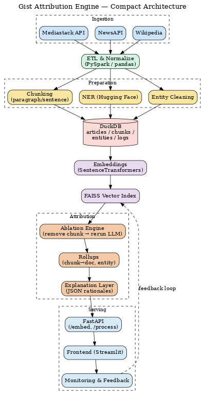

# Gist Attribution Engine

> **Fine‑grained, entity‑aware attribution for LLM answers - from ingestion to explanation**

[](#testing) [](#license) [](#installation) [](https://duckdb.org/) [](https://github.com/facebookresearch/faiss) [](https://www.sbert.net/)

---

## Overview

**Gist Attribution Engine** is a full-stack pipeline that transforms raw news articles and simulated user behavior into a **fine‑grained, attribution‑ready knowledge base**. The system performs **chunk‑level ablation** to measure how each paragraph influences an LLM’s answer, then rolls those scores up to **document** and **entity** levels with human‑readable explanations.

Why?

- Retrieval similarity ≠ true influence. We measure **causal impact** via ablation.
- Transparent, auditable attributions unlock **trust, licensing, and feedback loops**.
- Built for **researchers, builders, and product teams** who need explainable LLM outputs.

> Inspired by the Gist Attribution architecture (akin to ProRata.ai), but extended for **entity‑aware, session‑aware, and feedback‑ready** processing at scale.

---

## Table of Contents

- [Demo](#demo)
- [Installation](#installation)
- [Usage](#usage)
  - [ETL & Ingestion](#etl--ingestion)
  - [Embeddings & Vector Index](#embeddings--vector-index)
  - [Attribution (Ablation)](#attribution-ablation)
  - [Explanation Layer](#explanation-layer)
  - [HTTP API](#http-api)
- [Features](#features)
- [Architecture] (#architecture)
- [Project Structure](#project-structure)
- [Configuration](#configuration)
- [Contributing](#contributing)
- [Testing](#testing)
- [Deployment](#deployment)
- [Roadmap / TODO](#roadmap--todo)
- [License](#license)
- [Acknowledgments](#acknowledgments--credits)

---

## Demo

<!-- https://github.com/your-username/gist-attribution-engine/assets/demo.mp4 -->

<!--  -->


---

## Installation

### 1) Clone

```bash
git clone https://github.com/your-username/gist-attribution-engine.git
cd gist-attribution-engine
```

### 2) Environment

Using Conda (recommended):

```bash
conda env create -f environment.yaml
conda activate gist-attrib
```

Or with pip:

```bash
python -m venv .venv && source .venv/bin/activate   # or .venv\Scripts\activate on Windows
pip install -r requirements.txt
```

### 3) Data prerequisites

Ensure your DuckDB has the base tables (created by ETL):

- `articles` (id, title, source, published_at, content, tags)
- `article_chunks` (chunk_id, article_id, chunk_index, chunk_text)
- `doc_entities` / `doc_entities_cleaned`
- `user_events` (simulated sessions, views, clicks, feedback)

Paths used by default:

```
data/processed/duckdb/articles.duckdb
data/processed/embeddings.npy
data/processed/metadata.pkl
```

---

## Architecture



---

## Usage

### ETL & Ingestion

Articles are ingested from **Mediastack**, **NewsAPI**, and **Wikipedia**, then normalized to a common schema.  
We **do not ship data** in this repo - run the ETL locally with your own API keys.

Pipeline steps:

1. Fetch & clean articles → `mediastack_topics_news.csv`, `news_api_final.csv`, `wikipedia_articles.csv`
2. Split into paragraphs and run **NER** with Hugging Face (via PySpark)
3. Clean noisy entities and validate chunk structure
4. Load results into **DuckDB** (`articles`, `article_chunks`, `doc_entities`, `doc_entities_cleaned`, `user_events`)

Run in order:

```bash
python etl/ingestion/*.py
python etl/chunk_and_entity.py
python etl/clean_and_validate_entites.py
python etl/load_to_duck.py # only if needed
```

**Entity Cleaning & Validation (results):**

- 41,041 total chunks
- 55,421 raw entities → 38,483 cleaned
- 0 chunks with missing `chunk_id`
- Only 2 articles with non‑contiguous `chunk_index` (not critical)

### Embeddings & Vector Index

Embed paragraph chunks and prepare for FAISS search.

```bash
# Create embeddings table inside DuckDB, then dump to npy/pkl
python embedding/embedder.py
python embedding/dump_embeddings.py

# Quick vector search (FAISS)
python embedding/fast_vector_search.py   --query "trump"   --embeddings_path data/processed/embeddings.npy   --metadata_path data/processed/metadata.pkl   --top_k 5
```

### Attribution (Ablation)

Run chunk‑level ablation to measure causal influence on the LLM answer.

```bash
python attribution/run_ablation.py   --query "Why is inflation rising?"   --embeddings_path data/processed/embeddings.npy   --metadata_path data/processed/metadata.pkl   --top_k 5   --scoring_mode drift   --stream
```

**Scoring modes**

- `drift` - cosine drift between full vs. ablated answers (**recommended default**)
- `drift_faiss` - drift × retrieval score
- `drift_overlap` - drift + token Jaccard overlap

> In our evaluations, `drift` produced the most stable, intuitive attributions (less sensitive to retrieval artifacts and keyword noise).

**Drift thresholding**

```python
# low-impact chunks (< 0.05) get zeroed to reduce noise
if drift < 0.05:
    drift = 0.0
```

### Explanation Layer

Transform influence scores into human‑readable rationales.

```bash
python explanation/run_explanation.py   --input_path data/processed/output/attribution_results/<query>.json   --metadata_path data/processed/embeddings/metadata.pkl   --threshold 0.05
```

Output:

```
data/processed/output/explanation_results/<query>_explanation.json
```

### HTTP API

Start the backend and call it programmatically.

```bash
# run the API
uvicorn run_backend:app --reload --host 0.0.0.0 --port 8000
```

#### Endpoints

- `POST /embed` - run embedding pipeline and prepare artifacts
- `POST /first_response` - stream the first GPT answer (token-by-token)
- `POST /process` - full pipeline: ablation → explanation → metrics

**Examples**

```bash
# 1) Stream the first response
curl -X POST http://localhost:8000/first_response   -H "Content-Type: application/json"   -d '{"query":"What happened with NATO expansion?","top_k":5}'

# 2) Full processing
curl -X POST http://localhost:8000/process   -H "Content-Type: application/json"   -d '{
        "query":"How has Elon Musk influenced U.S. policy?",
        "top_k":5,
        "scoring_mode":"drift",
        "threshold":0.05
      }'
```

---

## Features

- **PySpark ETL** over multi‑source news + simulated user logs
- **Paragraph chunking** for interpretable, fine‑grained attribution
- **Hugging Face NER** (dslim/bert-base-NER) with aggressive entity cleaning
- **DuckDB** storage for fast, lightweight analytics
- **SentenceTransformers** embeddings (MiniLM by default)
- **FAISS** vector search (CPU/GPU) with blazing‑fast Top‑K retrieval
- **Ablation-based attribution** with multiple scoring modes
- **Entity‑ and session‑aware** design for richer analytics
- **Caching** of LLM prompts and embeddings to reduce costs
- **Explanation layer** that converts scores → human‑readable rationales
- **FastAPI backend** with streaming and end‑to‑end processing
- **Frontend‑ready** JSON outputs (chunk/doc/entity rollups, top docs, etc.)

---

## Configuration

Configure via **environment variables** or small JSON files.

**Environment variables**

- `OPENAI_API_KEY` - required for LLM calls in attribution/explanation
- `EMBEDDING_MODEL` - SentenceTransformers model (default: `all-MiniLM-L6-v2`)
- `DUCKDB_PATH` - path to DuckDB file (default: `data/processed/duckdb/articles.duckdb`)
- `FAISS_USE_GPU` - set to `1` to use FAISS-GPU if installed
- `ABLATION_SCORING_MODE` - `drift` | `drift_faiss` | `drift_overlap`

**Embedding/config**

```json
// embedding/config.json
{
  "model": "all-MiniLM-L6-v2",
  "encode_batch_size": 64,
  "n_threads": 4
}
```

**Notes**

- Low‑drift threshold currently at **0.05** (see attribution code)
- API expects embeddings artifacts at `data/processed/embeddings.npy` and `data/processed/metadata.pkl`

---

## Contributing

Contributions are welcome!

1. **Fork** the repo and create a feature branch
2. **Write tests** for your changes (`tests/`)
3. **Format** with `black` and `isort`; **lint** with `flake8`
4. **Commit** messages: conventional and descriptive
5. **Open a PR** with a clear summary, screenshots/logs where useful

For larger changes, please open an **Issue** first to discuss design & scope.

---

## Testing

Run the test suite:

```bash
pytest -q
```

Suggested local checks:

```bash
flake8 .
black --check .
isort --check-only .
```

---

## Deployment

**Backend (FastAPI + Uvicorn)**

```bash
uvicorn run_backend:app --host 0.0.0.0 --port 8000
```

**Notes**

- Keep `OPENAI_API_KEY` in secrets (env vars) - never commit keys
- Mount or provision persistent storage for `DuckDB` and outputs
- Consider a reverse proxy (nginx) and enable CORS if serving a web UI
- For GPU FAISS, deploy on CUDA-capable nodes

---

## Roadmap / TODO

### Completed

- [x] Entity-level influence rollup and visualizations
- [x] UI overlays for most-influential paragraphs & entities (frontend summary & explanations)
- [x] Real user logs ingestion (simulated sessions, clicks, queries, feedback fields)
- [x] Feedback-aware schema (feedback_useful / feedback_confusing in `user_events`)
- [x] Sentence-level ablation support
- [x] Default drift scoring mode evaluated & chosen (drift > drift_faiss / drift_overlap)

### In Progress / Partial

- [ ] Feedback-aware ranking logic (actually using feedback to reweight attribution)
- [ ] Observability: tracing, metrics, dashboards (schema ready, not wired up)

### Planned

- [ ] Token-level ablation experiments
- [ ] Cross-encoder re-ranking for post-retrieval refinement
- [ ] Persisted FAISS index; ANN with IVF/HNSW
- [ ] DuckDB Vector extension evaluation
- [ ] Exporters: CSV/Parquet/JSONL bundles for audits

---

## License

This project is licensed under the **MIT License**.  
Copyright (c) 2025 **Sneh Pillai**

```
Permission is hereby granted, free of charge, to any person obtaining a copy
of this software and associated documentation files (the “Software”), to deal
in the Software without restriction...
```

---

## Acknowledgments & Credits

- **ProRata.ai** - conceptual inspiration for attribution‑first thinking
- **SentenceTransformers** for easy, high‑quality embeddings
- **FAISS** for production‑grade vector search
- **DuckDB** for fast analytical storage
- **Hugging Face** for NER models
- **OpenAI** for LLM APIs used in ablation & explanations
- All contributors and maintainers who make this stack awesome ❤️
